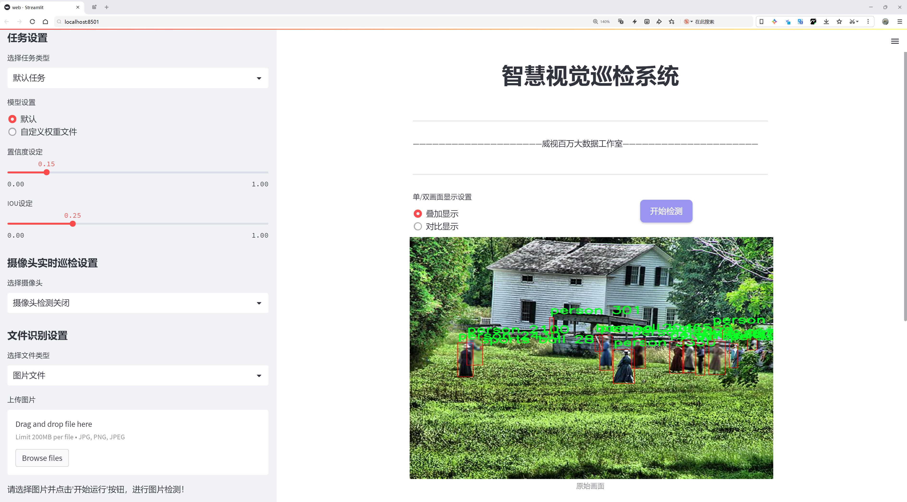

# 运动场景检测系统源码分享
 # [一条龙教学YOLOV8标注好的数据集一键训练_70+全套改进创新点发刊_Web前端展示]

### 1.研究背景与意义

项目参考[AAAI Association for the Advancement of Artificial Intelligence](https://gitee.com/qunmasj/projects)

研究背景与意义

随着科技的不断进步，计算机视觉技术在各个领域的应用日益广泛，尤其是在运动场景的检测与分析方面。运动场景的检测不仅可以为赛事直播提供实时数据支持，还可以为运动员的训练和表现分析提供科学依据。近年来，YOLO（You Only Look Once）系列目标检测算法因其高效性和准确性而受到广泛关注。YOLOv8作为该系列的最新版本，进一步提升了目标检测的速度和精度，为运动场景的实时检测提供了新的可能性。然而，现有的YOLOv8模型在特定运动场景下的应用仍然存在一定的局限性，尤其是在复杂背景和多目标情况下的检测效果有待提升。因此，基于改进YOLOv8的运动场景检测系统的研究显得尤为重要。

本研究所采用的数据集包含6847张图像，涵盖77个类别，涉及多种运动场景及相关物体。这些类别不仅包括常见的运动器材（如篮球、足球、网球拍等），还涵盖了日常生活中的物品（如书籍、家具、交通工具等）。这种多样化的类别设置为模型的训练提供了丰富的样本，有助于提高模型在复杂场景下的泛化能力。通过对这些数据的深入分析和处理，研究者可以探索如何在运动场景中有效识别和定位目标，从而为后续的应用提供基础。

运动场景检测系统的研究意义主要体现在以下几个方面：首先，提升运动赛事的观赏性和互动性。通过实时检测和分析运动场景中的关键元素，观众可以获得更为丰富的赛事信息，增强观看体验。其次，为运动员的训练和比赛策略提供数据支持。通过对运动场景的分析，教练和运动员可以更好地理解比赛动态，制定相应的训练计划和战术策略。此外，该系统还可以为运动科学研究提供数据基础，帮助研究者深入探讨运动表现与环境因素之间的关系。

在技术层面，改进YOLOv8模型的研究不仅可以推动目标检测技术的发展，还可以为其他领域的应用提供借鉴。例如，在智能监控、自动驾驶等领域，实时目标检测技术同样具有重要的应用价值。因此，本研究不仅具有理论意义，还具有广泛的实际应用前景。

综上所述，基于改进YOLOv8的运动场景检测系统的研究，不仅为运动赛事的实时分析提供了新的技术手段，也为运动科学研究和训练提供了重要的数据支持。通过对运动场景的深入探索，我们期望能够推动相关领域的发展，促进计算机视觉技术的进一步应用与创新。

### 2.图片演示




##### 注意：由于此博客编辑较早，上面“2.图片演示”和“3.视频演示”展示的系统图片或者视频可能为老版本，新版本在老版本的基础上升级如下：（实际效果以升级的新版本为准）

  （1）适配了YOLOV8的“目标检测”模型和“实例分割”模型，通过加载相应的权重（.pt）文件即可自适应加载模型。

  （2）支持“图片识别”、“视频识别”、“摄像头实时识别”三种识别模式。

  （3）支持“图片识别”、“视频识别”、“摄像头实时识别”三种识别结果保存导出，解决手动导出（容易卡顿出现爆内存）存在的问题，识别完自动保存结果并导出到。

  （4）支持Web前端系统中的标题、背景图等自定义修改，后面提供修改教程。

  另外本项目提供训练的数据集和训练教程,暂不提供权重文件（best.pt）,需要您按照教程进行训练后实现图片演示和Web前端界面演示的效果。

### 3.视频演示

[3.1 视频演示](https://www.bilibili.com/video/BV1XdWoeNEiJ/?vd_source=bc9aec86d164b67a7004b996143742dc)

### 4.数据集信息展示

数据集信息展示

本数据集名为“篮球”，专为改进YOLOv8的运动场景检测系统而设计，包含6847张高质量图像，旨在提升模型在复杂运动环境中的物体检测能力。数据集的丰富性和多样性使其成为训练深度学习模型的理想选择，尤其是在涉及运动和动态场景的应用中。该数据集涵盖77个类别，涵盖了从日常物品到运动器材的广泛范围，具体类别包括但不限于：气球、篮球、汽车、狗、猫、火 hydrant、交通信号灯等。这种多样性不仅有助于提高模型的泛化能力，还能使其在不同场景下的表现更加出色。

在数据集中，篮球作为主要目标对象，具有重要的研究价值。篮球的检测和识别对于运动分析、赛事监控以及相关应用程序的开发至关重要。通过对篮球的准确检测，系统能够实现对运动员行为的分析、比赛策略的优化以及观众体验的提升。此外，数据集中还包含其他与运动相关的物体，如运动器材（如网球拍、滑板等）和运动场景中的人物，这为模型提供了丰富的上下文信息，有助于提升检测的准确性和可靠性。

每张图像都经过精心标注，确保模型在训练过程中能够学习到各个类别的特征。这种高质量的标注不仅提高了模型的训练效率，还减少了误检和漏检的概率。数据集中的图像涵盖了不同的拍摄角度、光照条件和背景环境，使得模型能够在各种现实场景中表现良好。通过对这些图像的分析，YOLOv8模型将能够更好地理解和预测运动场景中的动态变化。

此外，数据集的开放性和可共享性也为研究人员和开发者提供了便利。根据CC BY 4.0许可证，用户可以自由使用、修改和分发数据集，这为学术研究和商业应用提供了良好的基础。研究人员可以在此基础上进行进一步的实验和优化，推动运动场景检测技术的发展。

综上所述，篮球数据集不仅为YOLOv8模型的训练提供了丰富的素材，还为运动场景检测的研究提供了坚实的基础。通过利用该数据集，研究人员和开发者能够在运动分析、智能监控等领域实现更高效的解决方案。随着技术的不断进步和数据集的不断完善，未来的运动场景检测系统将能够更加智能化和自动化，为体育赛事的分析和观众体验的提升带来新的机遇。


### 5.全套项目环境部署视频教程（零基础手把手教学）

[5.1 环境部署教程链接（零基础手把手教学）](https://www.ixigua.com/7404473917358506534?logTag=c807d0cbc21c0ef59de5)


[5.2 安装Python虚拟环境创建和依赖库安装视频教程链接（零基础手把手教学）](https://www.ixigua.com/7404474678003106304?logTag=1f1041108cd1f708b01a)

### 6.手把手YOLOV8训练视频教程（零基础小白有手就能学会）

[6.1 环境部署教程链接（零基础手把手教学）](https://www.ixigua.com/7404477157818401292?logTag=d31a2dfd1983c9668658)

### 7.70+种全套YOLOV8创新点代码加载调参视频教程（一键加载写好的改进模型的配置文件）

[7.1 环境部署教程链接（零基础手把手教学）](https://www.ixigua.com/7404478314661806627?logTag=29066f8288e3f4eea3a4)

### 8.70+种全套YOLOV8创新点原理讲解（非科班也可以轻松写刊发刊，V10版本正在科研待更新）

由于篇幅限制，每个创新点的具体原理讲解就不一一展开，具体见下列网址中的创新点对应子项目的技术原理博客网址【Blog】：


[8.1 70+种全套YOLOV8创新点原理讲解链接](https://gitee.com/qunmasj/good)

### 9.系统功能展示（检测对象为举例，实际内容以本项目数据集为准）

图1.系统支持检测结果表格显示

  图2.系统支持置信度和IOU阈值手动调节

  图3.系统支持自定义加载权重文件best.pt(需要你通过步骤5中训练获得)

  图4.系统支持摄像头实时识别

  图5.系统支持图片识别

  图6.系统支持视频识别

  图7.系统支持识别结果文件自动保存

  图8.系统支持Excel导出检测结果数据


### 10.原始YOLOV8算法原理

原始YOLOv8算法原理

YOLOv8算法是Ultralytics公司在2023年推出的一个重大更新版本，它在前几代YOLO模型的基础上进行了全面的改进和优化，旨在提升目标检测、图像分割和图像分类任务的性能和灵活性。作为YOLO系列的最新成员，YOLOv8不仅延续了以往版本的设计理念，还融入了新的技术创新，使其在计算机视觉领域中脱颖而出。

YOLOv8的网络结构以高效、准确和易于使用为设计核心，输入图像的默认尺寸为640x640。在实际应用中，由于采集的图像长宽比可能各异，YOLOv8采用自适应图像缩放技术，以提高目标检测和推理的速度。这种方法通过将图像的长边按比例缩小到指定尺寸，并对短边进行填充，最大限度地减少了信息冗余，提升了模型的实用性。此外，在训练阶段，YOLOv8引入了Mosaic图像增强技术，通过随机拼接四张图像，生成新的训练样本，迫使模型学习不同位置和周围像素的特征，从而提高了预测精度和模型性能。

在网络的主干部分，YOLOv8借鉴了YOLOv7中的ELAN模块设计思想，将YOLOv5中的C3模块替换为C2F模块。C2F模块通过并行化更多的梯度流分支，增强了特征提取的能力，进而提升了模型的精度和效率。与C3模块相比，C2F模块在保持轻量化的同时，能够获得更丰富的梯度流信息，优化了信息传递的过程。这种结构的改进使得YOLOv8在特征提取方面表现得更加出色。

在Neck部分，YOLOv8的设计同样进行了重要的变革。相较于YOLOv5，YOLOv8去除了两次上采样之前的1x1卷积连接层，直接对Backbone不同阶段输出的特征进行上采样。这一简化的结构不仅提高了计算效率，还减少了模型的复杂性，使得YOLOv8在处理高分辨率图像时更加高效。

YOLOv8在Head部分的变化尤为显著，采用了Decoupled-Head（解耦头）结构，取代了YOLOv5中的Coupled-Head（耦合头）。在新的Head结构中，检测和分类的卷积操作被解耦，特征图首先通过两个1x1卷积模块进行降维，然后分别进行类别预测和边界框位置及IoU（交并比）预测。这种解耦设计不仅提高了模型的灵活性，还优化了损失函数的设计，YOLOv8在分类分支中使用BCELoss（Binary Cross Entropy Loss），而在边界框回归分支中则采用DFL（Distribution Focal Loss）和CIoULoss，旨在快速聚焦于标签附近的数值，提高模型的准确性。

此外，YOLOv8摒弃了以往的Anchor-Based（基于锚框）方法，转而采用Anchor-Free（无锚框）的方法。传统的Anchor-Based方法需要预设目标可能存在的锚框，这在处理差异较大的物体时往往不够灵活。而YOLOv8通过将目标检测转化为关键点检测，避免了在训练前对数据集进行锚框聚类的复杂过程，提升了模型的泛化能力和框架的简洁性。

YOLOv8的创新不仅体现在网络结构的改进上，还包括对损失函数的优化和计算效率的提升。新的损失函数设计使得模型在训练和推理过程中能够更好地处理目标的存在性和位置精度问题，进一步提高了检测的准确性和速度。YOLOv8在各类硬件平台上均能高效运行，适应性强，成为了实时目标检测领域的佼佼者。

总的来说，YOLOv8通过引入新的骨干网络、解耦的检测头和创新的损失函数，全面提升了目标检测的性能和效率。其在COCOval2017数据集上的表现优于以往所有已知模型，标志着YOLO系列在计算机视觉领域的又一次飞跃。YOLOv8不仅在精度和速度上达到了新的高度，还为后续的研究和应用提供了强大的基础，预示着目标检测技术的未来发展方向。


### 11.项目核心源码讲解（再也不用担心看不懂代码逻辑）

#### 11.1 ui.py

以下是经过简化和注释的核心代码部分：

```python
import sys
import subprocess
from QtFusion.path import abs_path

def run_script(script_path):
    """
    使用当前 Python 环境运行指定的脚本。

    Args:
        script_path (str): 要运行的脚本路径
    """
    # 获取当前 Python 解释器的路径
    python_path = sys.executable

    # 构建运行命令，使用 streamlit 运行指定的脚本
    command = f'"{python_path}" -m streamlit run "{script_path}"'

    # 执行命令并等待其完成
    result = subprocess.run(command, shell=True)
    
    # 检查命令执行结果，如果返回码不为0，则表示出错
    if result.returncode != 0:
        print("脚本运行出错。")

# 主程序入口
if __name__ == "__main__":
    # 获取要运行的脚本的绝对路径
    script_path = abs_path("web.py")

    # 调用函数运行脚本
    run_script(script_path)
```

### 代码注释说明：
1. **导入模块**：
   - `sys`：用于获取当前 Python 解释器的路径。
   - `subprocess`：用于执行外部命令。
   - `abs_path`：从 `QtFusion.path` 模块导入的函数，用于获取文件的绝对路径。

2. **`run_script` 函数**：
   - 该函数接收一个脚本路径作为参数，并使用当前 Python 环境运行该脚本。
   - 使用 `sys.executable` 获取当前 Python 解释器的路径。
   - 构建一个命令字符串，使用 `streamlit` 运行指定的脚本。
   - 使用 `subprocess.run` 执行命令，并检查返回码以判断脚本是否成功运行。

3. **主程序入口**：
   - 使用 `if __name__ == "__main__":` 确保只有在直接运行该脚本时才会执行以下代码。
   - 调用 `abs_path` 函数获取 `web.py` 的绝对路径。
   - 调用 `run_script` 函数来运行该脚本。

这个程序文件 `ui.py` 是一个用于运行 Python 脚本的简单工具，特别是用来启动一个 Streamlit 应用。首先，文件中导入了一些必要的模块，包括 `sys`、`os` 和 `subprocess`，以及一个自定义的路径处理函数 `abs_path`，这个函数可能用于获取文件的绝对路径。

在 `run_script` 函数中，程序接受一个参数 `script_path`，这个参数是要运行的脚本的路径。函数首先获取当前 Python 解释器的路径，使用 `sys.executable` 来实现。接着，构建一个命令字符串，这个命令会调用 Streamlit 来运行指定的脚本。命令的格式是 `"{python_path}" -m streamlit run "{script_path}"`，其中 `{python_path}` 和 `{script_path}` 会被实际的路径替换。

然后，使用 `subprocess.run` 方法来执行这个命令。这个方法会在一个新的 shell 中运行命令，并等待其完成。如果脚本运行的返回码不为 0，表示执行过程中出现了错误，程序会打印出“脚本运行出错。”的提示。

在文件的最后部分，使用 `if __name__ == "__main__":` 来确保当这个文件作为主程序运行时，以下代码块会被执行。这里指定了要运行的脚本路径为 `web.py`，并调用 `run_script` 函数来执行这个脚本。

总的来说，这个文件的主要功能是通过当前的 Python 环境来运行一个指定的 Streamlit 应用脚本，提供了一种简便的方式来启动 Web 应用。

#### 11.2 ultralytics\models\rtdetr\model.py

以下是经过简化和注释的核心代码部分：

```python
# 导入必要的模块
from ultralytics.engine.model import Model
from ultralytics.nn.tasks import RTDETRDetectionModel

# 定义RT-DETR类，继承自Model类
class RTDETR(Model):
    """
    RT-DETR模型接口，基于视觉变换器的实时目标检测器，提供高效的检测性能和准确性。
    """

    def __init__(self, model="rtdetr-l.pt") -> None:
        """
        初始化RT-DETR模型，加载指定的预训练模型文件。

        参数:
            model (str): 预训练模型的路径，默认为'rtdetr-l.pt'。

        异常:
            NotImplementedError: 如果模型文件扩展名不是'pt'、'yaml'或'yml'。
        """
        # 检查模型文件的扩展名是否有效
        if model and model.split(".")[-1] not in ("pt", "yaml", "yml"):
            raise NotImplementedError("RT-DETR只支持从*.pt、*.yaml或*.yml文件创建。")
        # 调用父类的初始化方法
        super().__init__(model=model, task="detect")

    @property
    def task_map(self) -> dict:
        """
        返回RT-DETR的任务映射，将任务与相应的Ultralytics类关联。

        返回:
            dict: 一个字典，将任务名称映射到RT-DETR模型的Ultralytics任务类。
        """
        return {
            "detect": {
                "predictor": RTDETRPredictor,  # 预测器
                "validator": RTDETRValidator,   # 验证器
                "trainer": RTDETRTrainer,       # 训练器
                "model": RTDETRDetectionModel,   # 检测模型
            }
        }
```

### 代码说明：
1. **导入模块**：导入了`Model`类和`RTDETRDetectionModel`，这些是实现RT-DETR功能所需的基础组件。
2. **RTDETR类**：定义了一个名为`RTDETR`的类，继承自`Model`，用于实现RT-DETR模型的功能。
3. **初始化方法**：在初始化方法中，检查输入的模型文件格式是否有效，并调用父类的初始化方法以设置模型和任务类型。
4. **任务映射**：定义了一个属性`task_map`，返回一个字典，将检测任务与相应的预测器、验证器、训练器和模型类关联，便于后续调用和管理。

这个程序文件是关于百度的RT-DETR模型的接口实现，RT-DETR是一种基于视觉变换器（Vision Transformer）的实时目标检测器。该模型在CUDA和TensorRT等加速后端上表现出色，提供了实时性能和高准确性。它采用了高效的混合编码器和IoU（Intersection over Union）感知的查询选择机制，以提高检测精度。

文件中首先导入了所需的模块，包括Ultralytics引擎中的Model类、RTDETRDetectionModel类，以及预测、训练和验证相关的模块。接着定义了RTDETR类，该类继承自Model类，作为RT-DETR模型的接口。

在RTDETR类的构造函数中，初始化了模型，默认使用名为“rtdetr-l.pt”的预训练模型文件。构造函数检查传入的模型文件扩展名是否为支持的格式（.pt、.yaml或.yml），如果不符合要求，则抛出NotImplementedError异常。

此外，RTDETR类还定义了一个名为task_map的属性，该属性返回一个字典，映射了与RT-DETR模型相关的任务名称及其对应的Ultralytics类，包括预测器（predictor）、验证器（validator）、训练器（trainer）和模型（model）。这个映射关系使得用户可以方便地访问与特定任务相关的功能。

总体而言，这个文件为RT-DETR模型提供了一个清晰的接口，方便用户进行目标检测任务的预测、训练和验证，同时确保了模型的高效性和准确性。

#### 11.3 ultralytics\utils\callbacks\clearml.py

以下是代码中最核心的部分，并附上详细的中文注释：

```python
# 导入必要的库
from ultralytics.utils import LOGGER, SETTINGS, TESTS_RUNNING

# 尝试导入 ClearML 库并进行一些基本的检查
try:
    assert not TESTS_RUNNING  # 确保当前不是在运行测试
    assert SETTINGS["clearml"] is True  # 确保 ClearML 集成已启用
    import clearml
    from clearml import Task
    from clearml.binding.frameworks.pytorch_bind import PatchPyTorchModelIO
    from clearml.binding.matplotlib_bind import PatchedMatplotlib

    assert hasattr(clearml, "__version__")  # 确保 ClearML 包不是一个目录

except (ImportError, AssertionError):
    clearml = None  # 如果导入失败，设置 clearml 为 None


def on_pretrain_routine_start(trainer):
    """在预训练例程开始时运行；初始化并连接/记录任务到 ClearML。"""
    try:
        task = Task.current_task()  # 获取当前任务
        if task:
            # 确保自动的 PyTorch 和 Matplotlib 绑定被禁用
            PatchPyTorchModelIO.update_current_task(None)
            PatchedMatplotlib.update_current_task(None)
        else:
            # 初始化一个新的 ClearML 任务
            task = Task.init(
                project_name=trainer.args.project or "YOLOv8",  # 项目名称
                task_name=trainer.args.name,  # 任务名称
                tags=["YOLOv8"],  # 标签
                output_uri=True,
                reuse_last_task_id=False,
                auto_connect_frameworks={"pytorch": False, "matplotlib": False},  # 禁用自动连接
            )
            LOGGER.warning(
                "ClearML Initialized a new task. If you want to run remotely, "
                "please add clearml-init and connect your arguments before initializing YOLO."
            )
        task.connect(vars(trainer.args), name="General")  # 连接训练器参数
    except Exception as e:
        LOGGER.warning(f"WARNING ⚠️ ClearML installed but not initialized correctly, not logging this run. {e}")


def on_train_epoch_end(trainer):
    """在 YOLO 训练的每个 epoch 结束时记录调试样本并报告当前训练进度。"""
    task = Task.current_task()  # 获取当前任务
    if task:
        # 记录调试样本
        if trainer.epoch == 1:
            _log_debug_samples(sorted(trainer.save_dir.glob("train_batch*.jpg")), "Mosaic")
        # 报告当前训练进度
        for k, v in trainer.label_loss_items(trainer.tloss, prefix="train").items():
            task.get_logger().report_scalar("train", k, v, iteration=trainer.epoch)  # 记录训练损失
        for k, v in trainer.lr.items():
            task.get_logger().report_scalar("lr", k, v, iteration=trainer.epoch)  # 记录学习率


def on_train_end(trainer):
    """在训练完成时记录最终模型及其名称。"""
    task = Task.current_task()  # 获取当前任务
    if task:
        # 记录最终结果，包括混淆矩阵和 PR 曲线
        files = [
            "results.png",
            "confusion_matrix.png",
            "confusion_matrix_normalized.png",
            *(f"{x}_curve.png" for x in ("F1", "PR", "P", "R")),
        ]
        files = [(trainer.save_dir / f) for f in files if (trainer.save_dir / f).exists()]  # 过滤存在的文件
        for f in files:
            _log_plot(title=f.stem, plot_path=f)  # 记录图像
        # 报告最终指标
        for k, v in trainer.validator.metrics.results_dict.items():
            task.get_logger().report_single_value(k, v)  # 记录单个指标
        # 记录最终模型
        task.update_output_model(model_path=str(trainer.best), model_name=trainer.args.name, auto_delete_file=False)


# 定义回调函数，如果 ClearML 可用则注册相应的回调
callbacks = (
    {
        "on_pretrain_routine_start": on_pretrain_routine_start,
        "on_train_epoch_end": on_train_epoch_end,
        "on_fit_epoch_end": on_fit_epoch_end,
        "on_val_end": on_val_end,
        "on_train_end": on_train_end,
    }
    if clearml
    else {}
)
```

### 代码核心部分说明：
1. **ClearML 集成**：代码首先尝试导入 ClearML 并进行一些基本的检查，确保环境配置正确。
2. **任务初始化**：在预训练开始时，初始化一个 ClearML 任务并连接训练器的参数，以便记录训练过程中的各种信息。
3. **训练过程记录**：在每个训练 epoch 结束时，记录调试样本、训练损失和学习率等信息，以便后续分析。
4. **训练结束处理**：在训练结束时，记录最终的模型、混淆矩阵和其他指标，确保所有重要信息都被记录下来。

这些功能对于监控和分析模型训练过程非常重要，尤其是在使用 YOLO 等复杂模型时。

这个程序文件是一个用于集成 ClearML 的回调函数模块，主要用于在 Ultralytics YOLO 模型训练过程中记录和管理实验数据。首先，文件导入了一些必要的库和模块，包括日志记录器、设置和测试状态。它尝试导入 ClearML 相关的库，并进行了一些基本的验证，如确保没有在测试状态下运行，并确认 ClearML 集成已启用。

接下来，定义了几个函数来处理不同的日志记录任务。`_log_debug_samples` 函数用于将图像文件作为调试样本记录到 ClearML 任务中。它接收文件路径列表和标题作为参数，检查每个文件是否存在，并提取批次信息以进行记录。

`_log_plot` 函数用于将图像作为绘图记录到 ClearML 的绘图部分。它使用 Matplotlib 库读取图像并创建一个没有坐标轴的图形，然后将其记录到当前任务中。

`on_pretrain_routine_start` 函数在预训练例程开始时运行，初始化并连接 ClearML 任务。如果当前没有任务，它会创建一个新任务，并设置项目名称、任务名称和标签。同时，它会禁用自动的 PyTorch 和 Matplotlib 绑定，以便手动记录这些信息。

`on_train_epoch_end` 函数在每个训练周期结束时运行，记录调试样本并报告当前的训练进度。如果是第一个周期，它会记录训练样本的图像，并将当前的损失和学习率记录到任务中。

`on_fit_epoch_end` 函数在每个适应周期结束时运行，记录模型信息和验证指标。它会记录每个周期的时间和指标，并在第一个周期时记录模型的基本信息。

`on_val_end` 函数在验证结束时运行，记录验证结果，包括标签和预测的图像。

`on_train_end` 函数在训练完成时运行，记录最终模型及其名称。它会记录最终的结果、混淆矩阵和其他性能曲线，并将最终模型更新到 ClearML 任务中。

最后，定义了一个回调字典，包含了上述函数，只有在成功导入 ClearML 的情况下才会被填充。这些回调函数在训练过程中会被自动调用，以便实时记录和管理实验数据。整体上，这个模块为 YOLO 模型的训练提供了强大的日志记录和管理功能，便于后续的分析和优化。

#### 11.4 train.py

以下是经过简化和注释的核心代码部分：

```python
import os
import torch
import yaml
from ultralytics import YOLO  # 导入YOLO模型

# 设置设备为GPU（如果可用），否则使用CPU
device = "0" if torch.cuda.is_available() else "cpu"

if __name__ == '__main__':  # 确保该模块被直接运行时才执行以下代码
    workers = 1  # 数据加载的工作进程数
    batch = 2    # 每个批次的样本数

    data_name = "data"  # 数据集名称
    # 获取数据集配置文件的绝对路径
    data_path = abs_path(f'datasets/{data_name}/{data_name}.yaml', path_type='current')  
    unix_style_path = data_path.replace(os.sep, '/')  # 将路径转换为Unix风格

    # 获取数据集目录路径
    directory_path = os.path.dirname(unix_style_path)
    
    # 读取YAML配置文件
    with open(data_path, 'r') as file:
        data = yaml.load(file, Loader=yaml.FullLoader)
    
    # 如果YAML文件中包含'path'项，则修改为当前目录路径
    if 'path' in data:
        data['path'] = directory_path
        # 将修改后的数据写回YAML文件
        with open(data_path, 'w') as file:
            yaml.safe_dump(data, file, sort_keys=False)

    # 加载YOLOv8模型
    model = YOLO(model='./ultralytics/cfg/models/v8/yolov8s.yaml', task='detect')  
    
    # 开始训练模型
    results2 = model.train(
        data=data_path,  # 指定训练数据的配置文件路径
        device=device,   # 指定使用的设备
        workers=workers, # 指定数据加载的工作进程数
        imgsz=640,       # 输入图像的大小
        epochs=100,      # 训练的轮数
        batch=batch,     # 每个批次的样本数
        name='train_v8_' + data_name  # 训练任务的名称
    )
```

### 代码注释说明：
1. **导入库**：导入必要的库，包括`os`（用于路径操作）、`torch`（用于深度学习）、`yaml`（用于处理YAML文件）和`YOLO`（用于目标检测模型）。
2. **设备选择**：根据是否有可用的GPU，选择训练设备为GPU或CPU。
3. **主程序入口**：确保只有在直接运行该脚本时才执行以下代码。
4. **参数设置**：设置数据加载的工作进程数和每个批次的样本数。
5. **数据集路径**：定义数据集名称并获取其配置文件的绝对路径，转换为Unix风格路径。
6. **读取和修改YAML文件**：读取数据集的YAML配置文件，修改其中的`path`项为当前目录路径，并将修改后的内容写回文件。
7. **模型加载**：加载YOLOv8模型的配置文件。
8. **模型训练**：调用模型的训练方法，传入数据路径、设备、工作进程数、图像大小、训练轮数、批次大小和训练任务名称等参数。

该程序文件`train.py`的主要功能是使用YOLOv8模型进行目标检测的训练。首先，程序导入了必要的库，包括`os`、`torch`、`yaml`和`ultralytics`中的YOLO模型。根据系统是否支持CUDA，程序会选择使用GPU（设备编号为"0"）或CPU进行计算。

在`__main__`模块中，程序设置了一些训练参数，包括工作进程数（`workers`）和批次大小（`batch`）。接下来，程序定义了数据集的名称为`data`，并构建了数据集配置文件的绝对路径。使用`abs_path`函数，程序获取了该路径，并将其转换为Unix风格的路径。

然后，程序获取了数据集目录的路径，并打开指定的YAML文件以读取数据集的配置。程序检查YAML文件中是否包含`path`项，如果存在，则将其修改为当前目录路径，并将更新后的内容写回YAML文件，以确保模型能够正确找到数据集。

接下来，程序加载了预训练的YOLOv8模型，指定了模型的配置文件路径和任务类型为目标检测。随后，程序调用`model.train()`方法开始训练模型，传入了一系列参数，包括数据配置文件路径、设备、工作进程数、输入图像大小（640x640）、训练的epoch数量（100）以及批次大小（2）。最后，训练任务的名称被设置为`train_v8_`加上数据集名称。

总体而言，该程序通过设置必要的参数和配置，完成了YOLOv8模型的训练准备和执行。

#### 11.5 ultralytics\utils\ops.py

以下是代码中最核心的部分，并附上详细的中文注释：

```python
import torch
import torchvision

def non_max_suppression(
    prediction,
    conf_thres=0.25,
    iou_thres=0.45,
    classes=None,
    agnostic=False,
    multi_label=False,
    labels=(),
    max_det=300,
    nc=0,  # 类别数量（可选）
    max_time_img=0.05,
    max_nms=30000,
    max_wh=7680,
    rotated=False,
):
    """
    对一组边界框执行非最大抑制（NMS），支持掩码和每个框多个标签。

    参数：
        prediction (torch.Tensor): 形状为 (batch_size, num_classes + 4 + num_masks, num_boxes) 的张量，
            包含预测的框、类别和掩码。张量应为模型输出的格式，例如 YOLO。
        conf_thres (float): 置信度阈值，低于该值的框将被过滤。有效值在 0.0 和 1.0 之间。
        iou_thres (float): IoU 阈值，低于该值的框在 NMS 过程中将被过滤。有效值在 0.0 和 1.0 之间。
        classes (List[int]): 要考虑的类别索引列表。如果为 None，则考虑所有类别。
        agnostic (bool): 如果为 True，则模型对类别数量不敏感，所有类别将被视为一个。
        multi_label (bool): 如果为 True，则每个框可能有多个标签。
        labels (List[List[Union[int, float, torch.Tensor]]]): 列表的列表，每个内部列表包含给定图像的先验标签。
        max_det (int): NMS 后要保留的最大框数量。
        nc (int, optional): 模型输出的类别数量。任何超出此数量的索引将被视为掩码。
        max_time_img (float): 处理一张图像的最大时间（秒）。
        max_nms (int): 传递给 torchvision.ops.nms() 的最大框数量。
        max_wh (int): 框的最大宽度和高度（像素）。

    返回：
        (List[torch.Tensor]): 长度为 batch_size 的列表，每个元素是形状为 (num_boxes, 6 + num_masks) 的张量，
            包含保留的框，列为 (x1, y1, x2, y2, confidence, class, mask1, mask2, ...)。
    """

    # 检查阈值的有效性
    assert 0 <= conf_thres <= 1, f"无效的置信度阈值 {conf_thres}，有效值在 0.0 和 1.0 之间"
    assert 0 <= iou_thres <= 1, f"无效的 IoU {iou_thres}，有效值在 0.0 和 1.0 之间"
    
    # 如果预测是列表或元组，则选择推理输出
    if isinstance(prediction, (list, tuple)):
        prediction = prediction[0]  # 选择仅推理输出

    bs = prediction.shape[0]  # 批大小
    nc = nc or (prediction.shape[1] - 4)  # 类别数量
    nm = prediction.shape[1] - nc - 4  # 掩码数量
    mi = 4 + nc  # 掩码起始索引
    xc = prediction[:, 4:mi].amax(1) > conf_thres  # 候选框

    # 设置
    time_limit = 0.5 + max_time_img * bs  # 超过此时间将退出
    multi_label &= nc > 1  # 多标签每框（增加 0.5ms/img）

    prediction = prediction.transpose(-1, -2)  # 形状转换
    if not rotated:
        prediction[..., :4] = xywh2xyxy(prediction[..., :4])  # xywh 转 xyxy

    t = time.time()  # 记录开始时间
    output = [torch.zeros((0, 6 + nm), device=prediction.device)] * bs  # 初始化输出
    for xi, x in enumerate(prediction):  # 遍历每张图像的推理结果
        x = x[xc[xi]]  # 根据置信度筛选框

        # 如果没有框则处理下一张图像
        if not x.shape[0]:
            continue

        # 分离边界框、类别和掩码
        box, cls, mask = x.split((4, nc, nm), 1)

        if multi_label:
            i, j = torch.where(cls > conf_thres)  # 多标签处理
            x = torch.cat((box[i], x[i, 4 + j, None], j[:, None].float(), mask[i]), 1)
        else:  # 仅保留最佳类别
            conf, j = cls.max(1, keepdim=True)
            x = torch.cat((box, conf, j.float(), mask), 1)[conf.view(-1) > conf_thres]

        # 根据类别筛选
        if classes is not None:
            x = x[(x[:, 5:6] == torch.tensor(classes, device=x.device)).any(1)]

        n = x.shape[0]  # 框的数量
        if not n:  # 如果没有框
            continue
        if n > max_nms:  # 如果框的数量超过最大限制
            x = x[x[:, 4].argsort(descending=True)[:max_nms]]  # 按置信度排序并去除多余框

        # 批量 NMS
        c = x[:, 5:6] * (0 if agnostic else max_wh)  # 类别偏移
        scores = x[:, 4]  # 置信度
        boxes = x[:, :4] + c  # 计算框
        i = torchvision.ops.nms(boxes, scores, iou_thres)  # 执行 NMS
        i = i[:max_det]  # 限制检测数量

        output[xi] = x[i]  # 保存结果
        if (time.time() - t) > time_limit:  # 检查时间限制
            break  # 超过时间限制

    return output  # 返回最终结果
```

### 代码核心部分说明：
1. **非最大抑制（NMS）**：该函数的主要目的是从模型的预测结果中筛选出最优的边界框，去除重叠度高的框，以减少冗余检测。
2. **参数设置**：函数接受多个参数，包括置信度阈值、IoU阈值、类别过滤等，以便灵活控制检测结果。
3. **框筛选与处理**：根据置信度和类别进行框的筛选，最终返回经过 NMS 处理后的边界框列表。

这个程序文件是Ultralytics YOLO模型的一个实用工具模块，主要包含了一些与图像处理、坐标转换、非极大值抑制（NMS）等相关的函数和类，适用于目标检测任务。以下是对代码的详细说明。

首先，文件中定义了一个`Profile`类，用于性能分析。这个类可以作为装饰器或上下文管理器使用，能够记录代码块的执行时间。初始化时可以指定设备（如CPU或GPU），并在进入和退出上下文时记录时间差。

接下来，定义了一些函数用于处理图像和边界框。`segment2box`函数将分割标签转换为边界框标签，确保边界框在图像内部。`scale_boxes`函数则用于根据图像的不同尺寸重新缩放边界框。`make_divisible`函数用于返回最接近的可被指定除数整除的数。

`nms_rotated`和`non_max_suppression`函数实现了非极大值抑制的功能，前者专门处理旋转边界框，后者则处理常规的边界框，能够根据置信度和IoU阈值过滤掉重叠的框。

`clip_boxes`和`clip_coords`函数用于将边界框和坐标限制在图像边界内，确保它们不会超出图像的范围。`scale_image`函数则用于将掩膜图像调整为原始图像的大小。

在坐标转换方面，`xyxy2xywh`和`xywh2xyxy`函数分别用于在不同的边界框格式之间进行转换，支持将坐标从左上角和右下角格式转换为中心点和宽高格式，反之亦然。此外，还有一些函数用于处理归一化坐标和处理不同格式的边界框。

文件中还包含了一些处理掩膜的函数，如`process_mask`和`process_mask_upsample`，用于将掩膜应用于边界框，并可以选择是否对掩膜进行上采样。

最后，`masks2segments`函数将掩膜转换为分段，支持选择策略以提取最大的分段或连接所有分段。`convert_torch2numpy_batch`函数则用于将PyTorch张量批量转换为NumPy数组，并调整维度。

整体而言，这个模块提供了多种图像处理和坐标转换的工具，便于在目标检测任务中进行数据预处理和后处理。

#### 11.6 ultralytics\models\fastsam\val.py

```python
# 导入必要的模块
from ultralytics.models.yolo.segment import SegmentationValidator
from ultralytics.utils.metrics import SegmentMetrics

class FastSAMValidator(SegmentationValidator):
    """
    自定义验证类，用于在Ultralytics YOLO框架中进行快速SAM（Segment Anything Model）分割。

    该类扩展了SegmentationValidator类，专门定制了快速SAM的验证过程。此类将任务设置为“分割”，并使用SegmentMetrics进行评估。此外，为了避免在验证过程中出现错误，禁用了绘图功能。
    """

    def __init__(self, dataloader=None, save_dir=None, pbar=None, args=None, _callbacks=None):
        """
        初始化FastSAMValidator类，将任务设置为“分割”，并将指标设置为SegmentMetrics。

        参数：
            dataloader (torch.utils.data.DataLoader): 用于验证的数据加载器。
            save_dir (Path, optional): 保存结果的目录。
            pbar (tqdm.tqdm): 用于显示进度的进度条。
            args (SimpleNamespace): 验证器的配置。
            _callbacks (dict): 用于存储各种回调函数的字典。

        注意：
            在此类中禁用了ConfusionMatrix和其他相关指标的绘图，以避免错误。
        """
        # 调用父类的初始化方法
        super().__init__(dataloader, save_dir, pbar, args, _callbacks)
        # 设置任务类型为“分割”
        self.args.task = "segment"
        # 禁用绘图功能以避免错误
        self.args.plots = False  
        # 初始化分割指标
        self.metrics = SegmentMetrics(save_dir=self.save_dir, on_plot=self.on_plot)
```

### 代码核心部分及注释说明：
1. **类定义**：`FastSAMValidator` 继承自 `SegmentationValidator`，用于快速SAM分割的自定义验证。
2. **构造函数**：初始化时设置任务类型为“分割”，并禁用绘图功能以避免错误。
3. **指标初始化**：使用 `SegmentMetrics` 来评估分割结果，保存结果到指定目录。

这个程序文件定义了一个名为 `FastSAMValidator` 的类，继承自 `SegmentationValidator`，用于在 Ultralytics YOLO 框架中进行快速 SAM（Segment Anything Model）分割的自定义验证。该类主要目的是定制验证过程，以适应快速 SAM 的需求。

在类的文档字符串中，描述了该类的功能和属性。它将任务设置为“分割”，并使用 `SegmentMetrics` 进行评估。此外，为了避免在验证过程中出现错误，类中禁用了绘图功能。

构造函数 `__init__` 初始化了 `FastSAMValidator` 类，接收多个参数，包括数据加载器、结果保存目录、进度条、配置参数和回调函数字典。构造函数中调用了父类的初始化方法，并将任务类型设置为“segment”。同时，禁用了绘图功能，以避免与混淆矩阵及其他相关指标的绘图出现错误。最后，实例化了 `SegmentMetrics`，用于保存验证结果并控制绘图选项。

总体来说，这个文件实现了一个专门用于快速 SAM 分割模型验证的类，简化了验证过程并确保在验证时不会产生不必要的错误。

### 12.系统整体结构（节选）

### 整体功能和构架概括

该项目是一个基于Ultralytics YOLO框架的目标检测和分割系统，主要实现了多种模型的训练、验证和推理功能。项目结构包括模型定义、数据处理、训练和验证逻辑，以及与外部工具（如ClearML）的集成。每个模块和文件都承担特定的功能，确保系统的高效性和可扩展性。

- **模型文件**（如`model.py`和`val.py`）负责定义模型架构和验证逻辑。
- **训练文件**（如`train.py`）用于设置训练参数并启动训练过程。
- **工具文件**（如`ops.py`和`callbacks/clearml.py`）提供了图像处理、坐标转换、性能分析和日志记录等功能。
- **用户界面文件**（如`ui.py`）用于启动应用程序，提供用户交互。
- **数据增强和处理文件**（如`augment.py`）用于对输入数据进行预处理和增强。

### 文件功能整理表

| 文件路径                                       | 功能描述                                                         |
|------------------------------------------------|------------------------------------------------------------------|
| `ui.py`                                       | 启动Streamlit应用，提供用户界面以运行目标检测模型。               |
| `ultralytics/models/rtdetr/model.py`          | 定义RT-DETR模型接口，支持目标检测任务的预测、训练和验证。        |
| `ultralytics/utils/callbacks/clearml.py`     | 集成ClearML，记录训练过程中的实验数据和结果。                    |
| `train.py`                                    | 设置训练参数并启动YOLOv8模型的训练过程。                        |
| `ultralytics/utils/ops.py`                    | 提供图像处理、坐标转换、非极大值抑制等实用工具函数。              |
| `ultralytics/models/fastsam/val.py`           | 定义FastSAM模型的验证逻辑，专门用于快速分割模型的验证过程。      |
| `ultralytics/assets/utils/__init__.py`        | 初始化包，可能包含一些工具函数或类的定义。                        |
| `ultralytics/models/yolo/obb/predict.py`      | 实现YOLO模型的推理逻辑，处理输入数据并生成预测结果。              |
| `ultralytics/nn/tasks.py`                     | 定义任务相关的功能，可能包括训练、验证和推理的通用接口。          |
| `ultralytics/data/augment.py`                 | 提供数据增强功能，处理输入数据以提高模型的泛化能力。              |

这个表格总结了每个文件的主要功能，帮助理解项目的整体结构和各个模块之间的关系。

注意：由于此博客编辑较早，上面“11.项目核心源码讲解（再也不用担心看不懂代码逻辑）”中部分代码可能会优化升级，仅供参考学习，完整“训练源码”、“Web前端界面”和“70+种创新点源码”以“13.完整训练+Web前端界面+70+种创新点源码、数据集获取”的内容为准。

### 13.完整训练+Web前端界面+70+种创新点源码、数据集获取


#完整训练+Web前端界面+70+种创新点源码、数据集获取链接

https://mbd.pub/o/bread/ZpqUlp1x